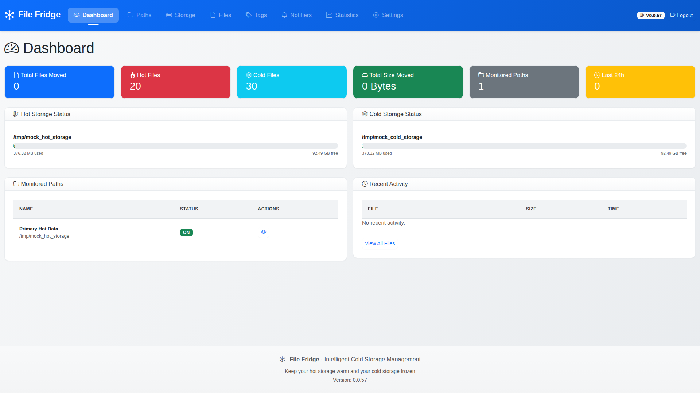
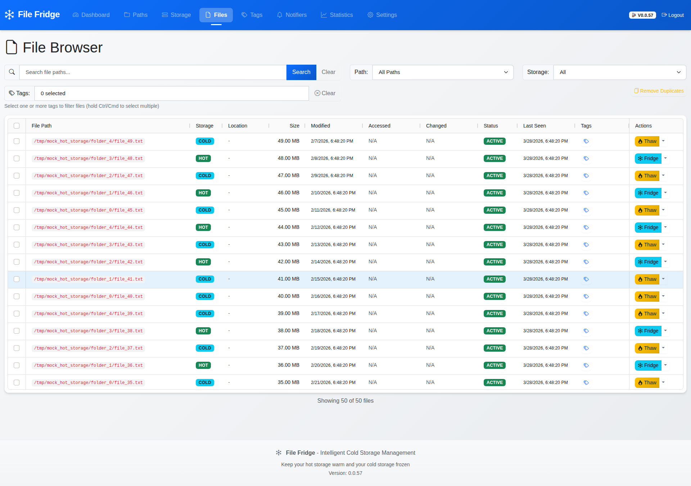
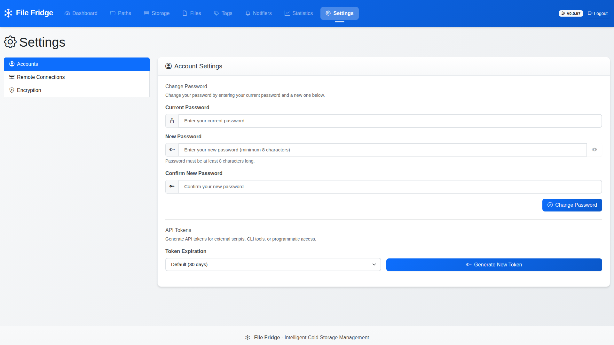

# File Fridge

### **CAUTION: Active Development**
**File Fridge is currently under active development.** While we strive for stability, updates may occasionally introduce breaking changes. Please ensure you have backups of your data and database before updating. Use at your own risk in production environments.

---

## What is File Fridge?

**File Fridge** is an intelligent storage management tool that helps you save money and space on your servers.

Do you have expensive, high-speed hard drives (Hot Storage) filling up with files you haven't looked at in months? Instead of buying more expensive drives, File Fridge automatically identifies those "cold" files and moves them to cheaper, high-capacity storage (Cold Storage).

Think of it as a smart assistant that keeps your desk (Hot Storage) clean by moving old paperwork into the filing cabinet (Cold Storage) for you.

## Why use File Fridge?

*   **Save Money**: Keep your expensive SSDs or high-speed drives free for the files you actually use.
*   **Automation**: Set your rules once and let File Fridge handle the cleanup on a schedule.
*   **Seamless Access**: Use the "Symlink" feature to move files while keeping them visible in their original location.
*   **Insights**: See exactly how much space you've saved and track your storage trends.
*   **Stay Organized**: Use tags and automated rules to categorize your data across all storage locations.
*   **Installable PWA**: Install File Fridge as a native app on mobile and desktop for a seamless experience.

## P2P File Sharing (V2)

File Fridge now supports private inter-instance file sharing over a **PSK-protected P2P network**.

### How it works

1. Configure a P2P network in **Settings** by creating a PSK and listen address/port.
2. Join additional File Fridge instances using **IP + Port + PSK**.
3. Each instance publishes metadata for local files marked as shareable.
4. Remote shared files are visible in the **`/files`** page and can be filtered from the **Storage** dropdown by peer.

### Share controls in `/files`

- Local files are shareable by default.
- Administrators can mark files as **Do Not Share** (single or bulk actions).
- Non-shareable files are excluded from P2P manifest publication.

### Breaking change notice

This release includes a **hard protocol cutover**:

- Legacy HTTP/signature-based remote sharing is removed.
- Existing legacy remote connections/transfers are dropped during migration.
- Older File Fridge versions using the legacy remote protocol cannot connect to updated instances.

## User Interface

Here is a glimpse of what File Fridge looks like:

### Dashboard


### File Inventory


### Settings


## Progressive Web App (PWA)

File Fridge is a Progressive Web App that can be installed on your devices for a native app-like experience.

### Installation

**Desktop (Chrome, Edge, Brave):**
1. Visit File Fridge in your browser
2. Look for the install icon in the address bar (📥 or ⋮ → "Install File Fridge")
3. Click to install and follow the prompts
4. The app will appear in your application menu and can be launched like any desktop app

**Desktop (Firefox):**
1. Visit File Fridge in your browser
2. Open the application menu (≡)
3. Select "Install this site as an application"
4. Follow the prompts to complete installation

**Mobile (Android Chrome):**
1. Visit File Fridge in Chrome
2. Tap the menu (⋮) → "Add to Home Screen" or "Install App"
3. Confirm and the app will be added to your home screen

**Mobile (iOS Safari):**
1. Visit File Fridge in Safari
2. Tap the Share button (⬆️)
3. Scroll down and tap "Add to Home Screen"
4. Tap "Add" to complete installation
5. The app will be added to your home screen and can be launched like any native app

**macOS Safari:**
1. Visit File Fridge in Safari
2. Click File → "Add to Dock" in the menu bar
3. Follow the prompts to add to your dock

### Offline Support

File Fridge supports basic offline functionality:
- Static assets (HTML, CSS, JS, icons) are cached for offline access
- Previously viewed pages remain available when offline
- A user-friendly message is shown when network requests fail offline

**Limitations:**
- File operations (scan, freeze, melt) require an active network connection
- Real-time statistics and file inventory data are not cached
- Background sync is not currently supported

### Browser Compatibility

| Browser | Installable | Offline Support | Notes |
|---------|-------------|-----------------|-------|
| Chrome (Desktop) | ✅ Yes | ✅ Yes | Full PWA support |
| Edge (Desktop) | ✅ Yes | ✅ Yes | Full PWA support |
| Brave (Desktop) | ✅ Yes | ✅ Yes | Full PWA support |
| Firefox (Desktop) | ✅ Yes | ⚠️ Limited | Manual installation required |
| Safari (macOS) | ✅ Yes | ✅ Yes | Add to Dock only |
| Chrome (Android) | ✅ Yes | ✅ Yes | Full PWA support |
| Safari (iOS) | ✅ Yes | ✅ Yes | Add to Home Screen only |
| Firefox (Android) | ✅ Yes | ⚠️ Limited | Manual installation required |

### Testing PWA

To verify PWA installation and functionality:

1. **Lighthouse Audit:**
   - Open Chrome DevTools (F12)
   - Go to the Lighthouse tab
   - Select "Progressive Web App" category
   - Run the audit - aim for 90-100 score

2. **Installability Check:**
   - Look for the install icon in the address bar
   - Check that `beforeinstallprompt` event fires (in Console)
   - Verify app launches in standalone mode after installation

3. **Offline Test:**
   - Open DevTools Network tab
   - Select "Offline" throttling
   - Reload the page - should show cached content
   - Attempt file operations - should show offline message

### Requirements

To use File Fridge as a PWA, your deployment must:
- Serve the application over **HTTPS** (required for service workers)
- Use a valid SSL certificate
- Have the manifest.json and service-worker.js accessible at the root level

**Note:** HTTPS configuration is the responsibility of the deploying administrator. See the [Installation Guide](docs/INSTALLATION.md) for deployment options.

## Frontend Asset Builds

The web UI is designed to run without CDN access. Third-party frontend dependencies are bundled locally with Vite and served from `static/dist/`.

```bash
npm install
npm run build
```

Jinja templates load these bundles through the `vite_assets(...)` helper, so new frontend dependencies should be added to the local build instead of linked from external CDNs.

## P2P E2E Test (Two Instances)

The P2P v2 end-to-end test boots **two isolated File Fridge instances**, creates a real file on instance A, joins instance B over PSK, verifies remote file visibility in `/files`, and then verifies unshare propagation.

```bash
PLAYWRIGHT_P2P_E2E=1 npm run test:e2e -- e2e/p2p-sharing.spec.ts
```

Notes:
- The test self-manages temporary DB/storage directories and cleans them up.
- It is intentionally gated behind `PLAYWRIGHT_P2P_E2E=1` because it is heavier than standard UI smoke tests.

## Getting Started

Getting File Fridge up and running is simple, especially if you use Docker.

1.  **Install**: Follow our [Installation Guide](docs/INSTALLATION.md) to get the application running.
2.  **Connect Storage**: Tell File Fridge where your "Hot" and "Cold" storage locations are.
3.  **Set Your Rules**: Decide which files should stay "Hot" (e.g., "Keep files accessed in the last 30 days").
4.  **Relax**: File Fridge will scan your files and move them to cold storage automatically.

## Detailed Documentation

For technical users, homelab enthusiasts, and enterprises, we have detailed guides available in the `docs/` directory:

*   **[Installation Guide](docs/INSTALLATION.md)**: Detailed steps for Docker and manual installations.
*   **[Usage Guide](docs/USAGE.md)**: How to get started with monitored paths and criteria.
*   **[Update Guide](docs/UPDATES.md)**: How to keep File Fridge up to date and our versioning strategy.
*   **[Feature Rundown](docs/FEATURES.md)**: A complete list of everything File Fridge can do.
*   **[Docker Deployment](docs/DOCKER.md)**: Advanced Docker configuration and symlink handling.
*   **[Usage & Best Practices](docs/CONFIGURATION_GUIDE.md)**: How to get the most out of your scan intervals and criteria.
*   **[Notifications](docs/NOTIFICATIONS.md)**: Setting up Email and Webhook alerts.
*   **[Tagging & Rules](docs/TAGGING.md)**: Organizing your files automatically.
*   **[REST API](docs/API.md)**: Information for developers and automation.

---

## License

Apache License 2.0 - See [LICENSE](LICENSE) file for details.

## Support

For issues, questions, or feature requests, please open an issue on the project repository.
